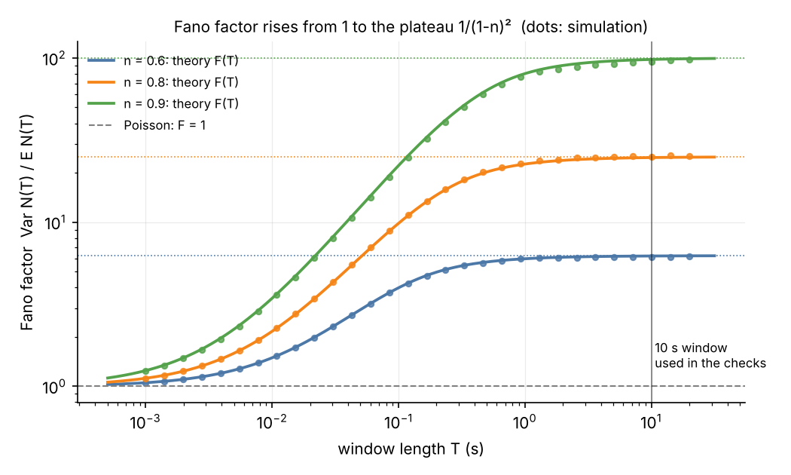
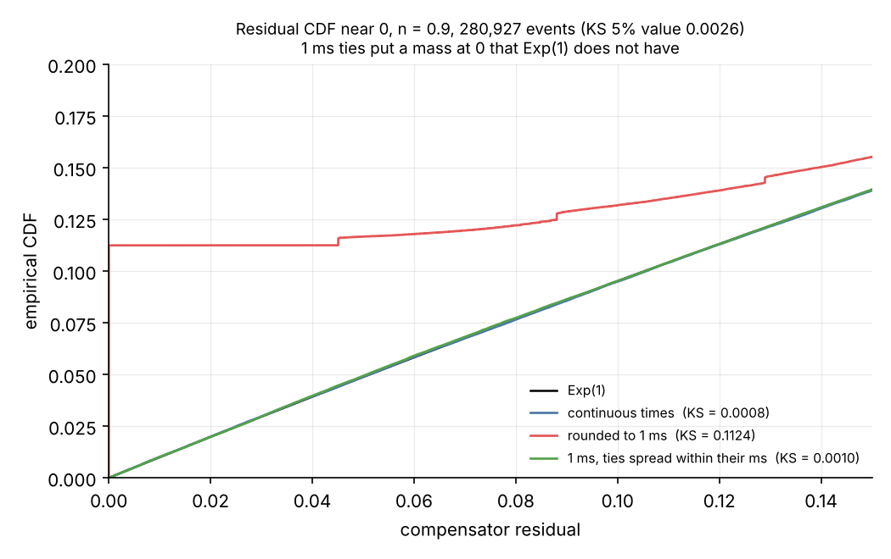

# Hawkes Quote Simulator — kdb+/q

End-to-end simulation of an intraday bid/ask quote stream driven by **self-exciting Hawkes processes**, built entirely in **kdb+/q**: simulation, statistical validation, partitioned historical database, as-of analytics, real-time replay through a tickerplant, and **maximum-likelihood recovery of the model parameters**.

> All data is simulated. This is a personal project to explore market-microstructure modelling and the kdb+ tick stack.

---

## Why Hawkes?

On real markets, events are not independent: a quote update tends to trigger further updates within milliseconds. A homogeneous Poisson process cannot reproduce this **clustering**. The Hawkes process can: each event temporarily raises the arrival intensity.

$$
\lambda(t) = \mu + \sum_{t_i < t} \alpha\ e^{-\beta (t - t_i)}
$$

| Parameter | Meaning | Value used |
|---|---|---|
| $\mu$ | baseline intensity (events/s) | 0.5 – 1.2 |
| $\alpha$ | jump in intensity after each event | 30 – 45 |
| $\beta$ | decay rate (memory $1/\beta$ = 20 ms) | 50 |
| $n = \alpha/\beta$ | branching ratio (must be < 1) | 0.6 – 0.9 |

Stationary mean rate: $\mu / (1-n)$, i.e. up to ~12 quotes/s on average for TSLA, with bursts much higher.

---

## Architecture

```
                       hawkes_quotes.q
   ┌──────────────┐    ┌──────────────────────────────┐      ┌──────────┐
   │  Simulation  │───►│ statistical checks            │─────►│  HDB     │──► mle.q
   │  (branching) │    │ (compensator, KS, ACF, Fano)  │      │  hdbq/   │    parameter
   └──────────────┘    └──────────────────────────────┘      │  date/   │    recovery
                                                              │  quote   │
                                                              └────┬─────┘
                                                                   └──► aj : bid/ask on a 1 ms grid
   feed.q                     tick.q (port 5010)            r.q
   ┌──────────────┐  .u.upd   ┌──────────────┐  publish   ┌──────────┐
   │ HDB day,     │──────────►│  tickerplant │───────────►│   RDB    │
   │ replay (x60) │           │  schema sym.q│            │          │
   └──────────────┘           └──────────────┘            └──────────┘

   lib/hawkes.q: parameters, simulator, residual tests, shared by all scripts
```

| File | Role |
|---|---|
| [`lib/hawkes.q`](lib/hawkes.q) | single source for the true parameters, the simulator and the residual tests |
| [`hawkes_quotes.q`](hawkes_quotes.q) | simulation, statistical checks, writes a 10-day partitioned HDB, 1 ms as-of grid |
| [`mle.q`](mle.q) | maximum-likelihood estimation of $(\mu,\alpha,\beta)$ on every day of the HDB, standard errors, coverage, goodness of fit |
| [`feed.q`](feed.q) | replays one stored HDB day into a tickerplant in accelerated time |
| [`sym.q`](sym.q) | kdb+tick schema for the `quote` table |
| [`docs/figures.py`](docs/figures.py) | Python port of the simulator that draws the two figures below |

---

## 1. Simulation — cluster representation

Instead of the classic thinning algorithm (sequential, one event at a time), the process is simulated through its **branching (cluster) representation**, which vectorises naturally in q:

1. **Immigrants**: Poisson($\mu T$) events uniformly distributed on $[0, T)$.
2. **Offspring**: each event generates Poisson($n$) children, each delayed by an Exp($\beta$) time.
3. Repeat on each new generation until extinction (guaranteed since $n<1$).

Each generation is processed as a whole vector: no per-event loop.

Prices follow a geometric random walk on the event clock, in integer cents, with a 1–3 cent spread placed around the mid. Timestamps are stored as `timespan` at **1 ms resolution**, partitioned by date with the `p#` attribute on `sym` (standard kdb+tick layout, written with `.Q.dpft`). The HDB holds the first 10 NYSE trading days of 2024 (weekends, New Year's Day and MLK Day excluded). The random seed is fixed (`\S 42`) so every run is reproducible.

---

## 2. Statistical validation

A simulator is only useful if it is checked. `hawkes_quotes.q` runs four tests per symbol:

- **Time-rescaling theorem**: the compensator increments $\Lambda(t_i) - \Lambda(t_{i-1})$ must be i.i.d. Exp(1). Checked with the mean, the variance and a **Kolmogorov–Smirnov test**.
- **Independence**: lag-1 autocorrelation of these increments ≈ 0.
- **Clustering**: the Fano factor (variance/mean of counts over 10 s windows) must be ≫ 1 and approach the theoretical value $1/(1-n)^2$, versus 1 for a Poisson process. See [docs/fano-factor.md](docs/fano-factor.md) for the derivation and the finite-window correction.

<p align="center"></p>

The curve is the exact finite-window formula; the dots come from a $2 \times 10^5$ s simulation (Python port, same algorithm). At short windows the process looks Poisson ($F \approx 1$); beyond $1/(\beta(1-n))$ it reaches the plateau, which identifies $n$.
- **Data integrity**: non-decreasing timestamps per symbol before writing to disk, and type checks on reload.

The script prints each statistic next to its 5 % critical value, plus a markdown version of the table.

---

## 3. Parameter recovery by maximum likelihood (`mle.q`)

The final check: can the true parameters be recovered **from the stored 1 ms data alone**?

The exponential kernel gives a log-likelihood computable in $O(n)$ through a recursion:

$$
\log L = \sum_i \log(\mu + \alpha A_i) - \mu T - \frac{\alpha}{\beta}\sum_i \left(1 - e^{-\beta (T - t_i)}\right),
\qquad A_i = e^{-\beta (t_i - t_{i-1})}(1 + A_{i-1})
$$

- **Optimiser**: a Nelder–Mead simplex written in q, run on $(\log\mu,\ \mathrm{logit} n,\ \log\beta)$ so that positivity and stationarity ($n<1$) hold without constraints.
- **Standard errors**: inverse of the numerical Hessian of $-\log L$ (observed Fisher information).
- **Hawkes vs Poisson**: likelihood-ratio test against a homogeneous Poisson process ($\chi^2_2$ at 5 % = 5.99).
- **Goodness of fit**: KS test on the compensator residuals computed with the *estimated* parameters.

### Results

Output of `q mle.q` on the first day of the HDB (2024.01.02, seed 42), estimates ± standard error:

| sym | N events | $\mu$ (true → est.) | $\alpha$ (true → est.) | $\beta$ (true → est.) | $n$ (true → est.) | LR vs Poisson |
|---|---|---|---|---|---|---|
| AAPL | 116,468 | 1.0 → 0.994 ± 0.007 | 40 → 39.98 ± 0.24 | 50 → 49.97 ± 0.27 | 0.80 → 0.800 | 432,522 |
| MSFT | 63,648 | 0.8 → 0.804 ± 0.006 | 35 → 34.93 ± 0.28 | 50 → 49.60 ± 0.34 | 0.70 → 0.704 | 207,804 |
| GOOG | 28,933 | 0.5 → 0.499 ± 0.005 | 30 → 29.74 ± 0.37 | 50 → 49.87 ± 0.51 | 0.60 → 0.596 | 88,088 |
| AMZN | 47,911 | 0.6 → 0.603 ± 0.005 | 35 → 35.35 ± 0.33 | 50 → 50.11 ± 0.39 | 0.70 → 0.705 | 174,603 |
| TSLA | 275,796 | 1.2 → 1.195 ± 0.008 | 45 → 44.84 ± 0.20 | 50 → 49.90 ± 0.20 | 0.90 → 0.899 | 1,142,515 |

Nelder–Mead converges in 53 to 63 iterations, in under 10 seconds per symbol.

- **Parameters are recovered on this day**: every standardised error (estimate − truth) / SE stays below 1.2 in absolute value. One day per symbol is a single draw, so it cannot by itself show that the estimator is unbiased or that the standard errors are right.
- **Hence the multi-day check.** `mle.q` fits all 50 (day, symbol) pairs and reports, per symbol and pooled, the mean and standard deviation of the standardised errors (expected ≈ 0 and ≈ 1) and the coverage of the 95 % intervals estimate ± 1.96 SE (expected ≈ 95 %). This is where a bias from the 1 ms rounding, or an underestimated SE, would show up. The full run takes a few minutes.
<!-- results: paste the "all days" markdown tables printed by `q mle.q` here -->
- **Self-excitation is overwhelming**: the likelihood ratio against a homogeneous Poisson process is in the hundreds of thousands. The usual $\chi^2_2$ reference (5.99 at 5 %) is only indicative here: under the Poisson null $\alpha = 0$ sits on the boundary of the parameter space and $\beta$ is not identified, so Wilks' theorem does not strictly apply (Davies' problem). At these magnitudes the conclusion does not depend on it.
- **On the stored 1 ms times, the residual KS test rejects for all five symbols, and that is informative.** Many events share a timestamp with the previous one (about 30,000 ties for TSLA, 11 % of its events; 2.5 % for GOOG). Each tie gives a compensator increment of exactly 0, so the empirical CDF of the residuals jumps at 0 by the share of ties, while Exp(1) has no mass there: the KS statistic is at least that share, far above the critical value (0.003 to 0.008 here).
- **Spreading each event uniformly within its millisecond removes the artefact.** `mle.q` reports this second statistic as `KSjit`, computed with the same estimated parameters. With a 20 ms memory, 1 ms is too coarse for residual tests on the raw stamps, but not once the rounding is undone.

<p align="center"></p>

Python port, TSLA parameters ($n = 0.9$), true parameters: the KS statistic goes from 0.0008 on continuous times to 0.112 after rounding to 1 ms (the 11 % mass at 0), and back to 0.0010 after spreading, against a 5 % critical value of 0.0026.


---

## How to run

Requires [kdb+](https://kx.com/kdb-personal-edition-download/) (free personal / community edition). Run from the repository root.

```bash
# 1. simulate, validate, write the HDB (hdbq/) and build the 1 ms grid
q hawkes_quotes.q

# 2. recover the parameters on every day of the HDB
q mle.q

# optional: redraw the README figures (numpy, matplotlib)
python docs/figures.py
```

Real-time replay with the standard [kdb+tick](https://github.com/KxSystems/kdb-tick) scripts (place `sym.q` in `tick/`):

```bash
q tick.q sym . -p 5010          # tickerplant
q tick/r.q :5010 -p 5011        # real-time database
q feed.q 60                     # replay the first HDB day at x60 (6h30 in 6 min 30 s)
q feed.q 60 2024.01.03          # or a given day
```

---

## Limitations

- **Prices carry no information from the order flow**: the mid is a random walk on the event clock, and spreads and sizes are i.i.d. The model is about *when* quotes arrive, not how prices form.
- **Univariate, stationary intensity**: one process per symbol, no cross-excitation, constant baseline (no intraday U-shape).
- **Calendar**: only the January 2024 NYSE holidays are encoded, which is enough for the 10 days generated.
- **Immigrant count**: drawn from the normal approximation to Poisson($\mu T$), negligible for $\mu T \geq 10^4$.

---

## Possible extensions

- Real-time subscriber computing spread and estimated intensity on the fly
- Multivariate Hawkes (cross-excitation between symbols, or between bid and ask sides)
- Intraday seasonality: time-varying baseline $\mu(t)$ (U-shaped activity)
- Price impact: make price moves depend on order-flow clustering

## Tech

`kdb+/q` · `kdb+tick` · `.Q.dpft` partitioned HDB · `aj` as-of join · point processes · maximum likelihood · Nelder–Mead

---

<p align="center">
  <a href="https://github.com/matthieu-briche">
    
  </a>
  <br>
  <sub>Matthieu Briche · <a href="https://github.com/matthieu-briche">github.com/matthieu-briche</a></sub>
</p>
